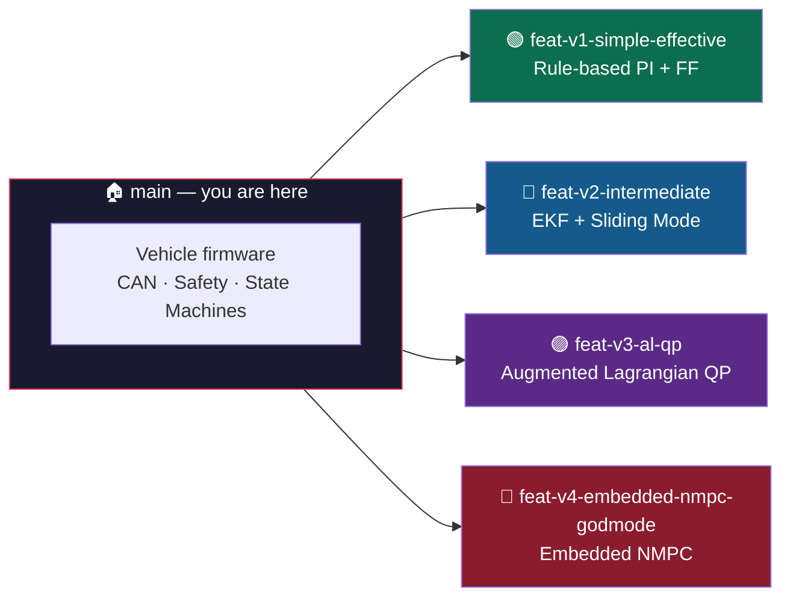
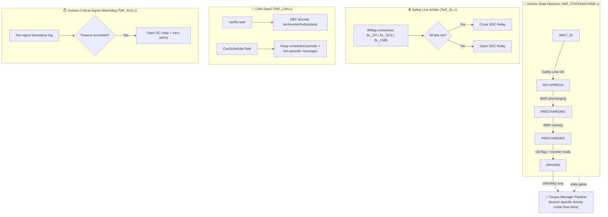
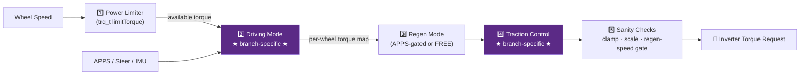
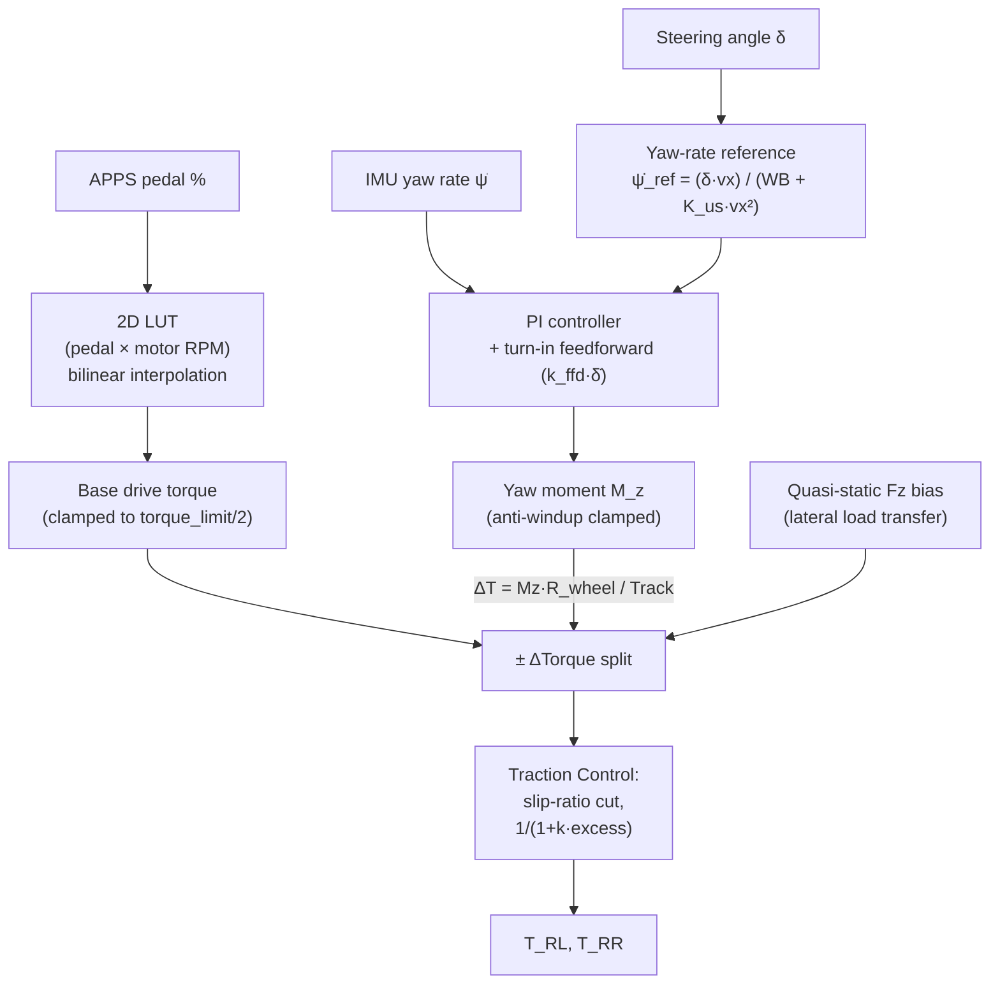
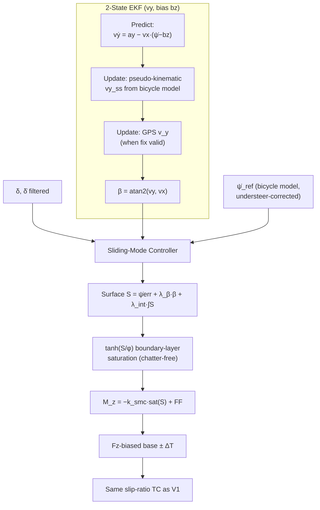
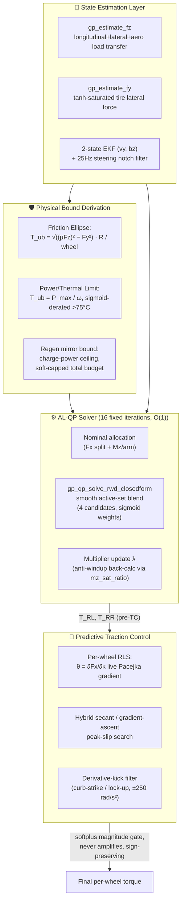
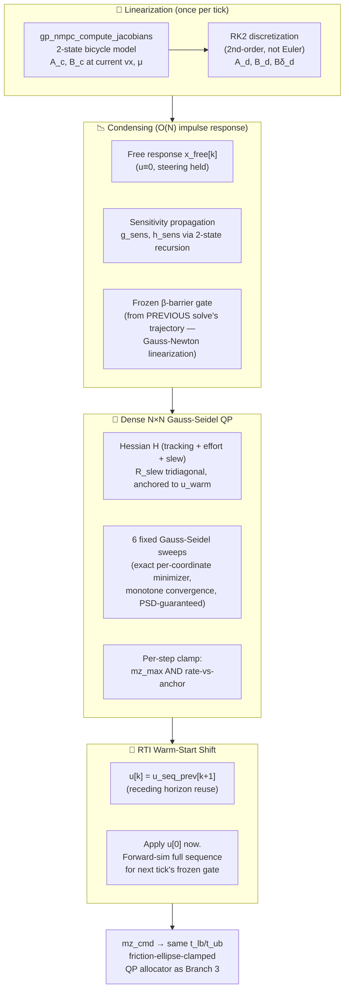
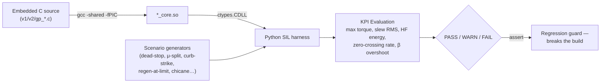

<div align="center">

# 🏎️ TeR_ECU — Torque Vectoring eRacing

### Tecnun eRacing · Formula Student Electric Monoplaza


-4B8BBE?style=for-the-badge)


**One vehicle. One ECU. Four generations of torque-vectoring control philosophy — living side by side as parallel branches, each a complete, buildable, independently-validated control stack.**

</div>

---

## 📚 Table of Contents

1. [What This Repository Is](#-what-this-repository-is)
2. [Repository Map — Branch Directory](#-repository-map--branch-directory)
3. [The Car: TeR_ECU Hardware Platform](#-the-car-ter_ecu-hardware-platform)
4. [Firmware Architecture (shared across all branches)](#-firmware-architecture-shared-across-all-branches)
5. [The Four Torque-Vectoring Generations](#-the-four-torque-vectoring-generations)
   - [🟢 Branch 1 — `feat-v1-simple-effective`](#-branch-1--feat-v1-simple-effective)
   - [🔵 Branch 2 — `feat-v2-intermediate`](#-branch-2--feat-v2-intermediate)
   - [🟣 Branch 3 — `feat-v3-al-qp`](#-branch-3--feat-v3-al-qp)
   - [🔴 Branch 4 — `feat-v4-embedded-nmpc-godmode`](#-branch-4--feat-v4-embedded-nmpc-godmode)
6. [Side-by-Side Comparison](#-side-by-side-comparison)
7. [Validation Philosophy — SIL Testing](#-validation-philosophy--sil-testing)
8. [How to Check Out a Branch](#-how-to-check-out-a-branch)
9. [Glossary](#-glossary)

---

## 🧭 What This Repository Is

This is the **control-software monorepo** for Tecnun eRacing's electric Formula Student car. The `main` branch you're reading right now is intentionally a **lobby, not a codebase** — the vehicle firmware (state machines, CAN bus stack, sensor drivers, safety systems) is common to every configuration, but the single most performance-critical subsystem — **rear-axle torque vectoring (TV) and traction control (TC)** — is developed as **four parallel, competing architectures**, each on its own branch, each representing a different point on the complexity/performance/determinism trade-off curve.



Why keep four branches instead of picking one winner? Because on a Formula Student car, **complexity is a liability under a competition deadline**. Branch 1 is the "always works, tow it home" fallback. Branch 3 is the current race-day default. Branch 4 is the research frontier. Having all three (plus Branch 2 as the historical stepping stone) checked out and buildable at any time means the team can *downgrade in five minutes* the night before a dynamic event if something in the advanced stack misbehaves.

---

## 🗂️ Repository Map — Branch Directory

| Branch | Nickname | Core Idea | Status |
|---|---|---|---|
| [`feat-v1-simple-effective`](#-branch-1--feat-v1-simple-effective) | **The Baseline** | Lookup-table torque + PI/feedforward yaw correction | ✅ Stable, always buildable |
| [`feat-v2-intermediate`](#-branch-2--feat-v2-intermediate) | **The Bridge** | 2-state EKF + Sliding Mode Control with β-suppression | ✅ Stable |
| [`feat-v3-al-qp`](#-branch-3--feat-v3-al-qp) | **The Workhorse** | Deterministic 16-iteration Augmented Lagrangian QP allocator | 🏆 Current race default |
| [`feat-v4-embedded-nmpc-godmode`](#-branch-4--feat-v4-embedded-nmpc-godmode) | **The Frontier** | Condensed real-time-iteration NMPC over an 8-step horizon | 🧪 Active R&D |

```bash
# Fetch every branch locally
git fetch --all

# Jump into any generation
git checkout <branch-name>
```

---

## 🔧 The Car: TeR_ECU Hardware Platform

Every branch runs on the same physical board and the same real-time operating system. This is the hardware substrate that every control law below has to survive on.

<div align="center">

| Subsystem | Spec |
|---|---|
| 🧠 **MCU** | STM32F405VGTx — ARM Cortex-M4 @ 168 MHz, hardware FPU |
| 🔁 **RTOS** | FreeRTOS via CMSIS-OS2, task-based scheduling |
| 🔌 **Comms** | 2× CAN 2.0 (Powertrain bus + main sensor bus), USB CDC diagnostics |
| 🛰️ **GPS** | u-blox NEO-M9N (active-antenna capable) — feeds `v_y` fusion in Branches 2–4 |
| 🧭 **IMU** | 9-DOF: ASM330LHH accel+gyro, LIS3MDL magnetometer, complementary-filtered attitude |
| ⚡ **Digital I/O** | 4× digital in (0–24 V), 4× high-side digital out (0–24 V) |
| 🎛️ **Actuation** | 4× PWM out (3.3 V, servo/aero flap control) |
| 📈 **Analog** | 4× analog in (0–3.3 V, configurable divider) |
| 💡 **Lighting** | 2× WS2812 RGB channels over SPI (FS-Spain LightShow compliant) |

</div>


---

## 🏗️ Firmware Architecture (shared across all branches)

Before any branch's torque-vectoring math ever runs, the ECU has already made sure the car is safe to move. This scaffolding is **identical across every branch** — only the block labeled *"Driving Mode"* below changes.



**Torque Manager pipeline** (`TeR_TRQMANAGER.c`) — the exact point where the four branches diverge:



This 5-stage function-pointer pipeline (`trqPipeline_t DriveConfig`) is what lets the team hot-swap Branch 1's `lineal()` for Branch 3's `gp_mode_intermediate()` by changing a single CAN-configurable enum (`TeR.config.driving_mode`) — no other file in the firmware needs to know which generation is active.

Also common to every branch: driverless-mode (DV) state machine (`AS_OFF → AS_READY → AS_DRIVING → AS_EMERGENCY/FINISHED`, FSG-rule-compliant), EEPROM-backed configuration system, GPS/IMU sensor tasks, and the WS2812 LightShow driver.

---

## 🌗 The Four Torque-Vectoring Generations

### 🟢 Branch 1 — `feat-v1-simple-effective`

> *"Il most reliable Nm on the grid."* — the fallback that never fails a scrutineering torque-limit check.

**Philosophy:** a fully deterministic, human-tunable, open-loop-friendly controller with **zero external dependencies** beyond a 2×11×11 lookup table and one PI+feedforward loop. If every advanced branch is unavailable on race morning, this is what goes on track.



**Key mechanisms:**
- **Drive torque map** — flash-resident `V1_DRIVE_TORQUE_MAP[11][11]`, indexed by pedal travel (0–100%) and motor RPM (0–20,000), bilinearly interpolated (`v1_lut_data.h`).
- **Yaw controller** — classic bicycle-model reference `ψ̇_ref = (v·δ)/(WB + K_us·v²)`, tracked with a speed-scheduled PI loop (`speed_gain_taper` softens gains at high speed) plus a **turn-in feedforward term** driven by filtered steering-rate (`k_ffd · δ̇_filt`) for snappier corner entry.
- **Quasi-static Fz load-transfer bias** — before any yaw correction is applied, base torque is *pre-biased* toward the outer wheel using a static lateral load-transfer estimate (`ΔFz = m·ay·h_cg / track`), so the controller isn't fighting load transfer from zero.
- **Traction control** — simple per-wheel slip-ratio threshold with a smooth `1/(1 + k·excess)` reduction, no state estimation required.
- **Safety rails:** steer/yaw deadzones, slew-rate limiting (`max_slew_nm_per_s`), PI anti-windup with same-sign gating, dead-stop division guard (`V1_V_FLOOR_MS`).

**Validated by:** `v1_sanity_checks.py` — 8 scenarios (dead-stop launch, LUT/RPM taper regression, μ-split, CAN glitch rejection, regen gate, symmetric wheelspin, turn-in feedforward boost, Fz load-transfer bias).

---

### 🔵 Branch 2 — `feat-v2-intermediate`

> *"Give the controller eyes."* — the first branch to estimate vehicle state instead of assuming it.

**Philosophy:** keep Branch 1's LUT-based longitudinal torque shaping, but replace the open-loop yaw reference and PI loop with a genuine **state observer** and a **nonlinear, chattering-resistant controller**. This is the bridge generation between "tuned gains" and "solved optimization problem."



**Key upgrades over Branch 1:**
- **Extended Kalman Filter (`v2_ekf_step`)** — tracks lateral velocity `vy` and gyro yaw-rate bias `bz`, fused sequentially from a kinematic pseudo-measurement *and* GPS lateral velocity (`vy_gps`) when a fix is valid. Bias-corrected yaw rate (`wz_corrected`) flows into every downstream control law.
- **Sliding Mode Control (SMC)** replaces the PI loop: sliding surface `S = ψ̇_err + λ_β·β + λ_int·∫S_dt`, saturated through a `tanh(S/φ)` boundary layer whose width `φ` grows with speed — eliminates classic SMC chattering while retaining the finite-time convergence and robustness-to-uncertainty that a PI loop can't offer.
- **Active sideslip suppression** — `β` (vehicle slip angle) is a first-class term in the sliding surface, not bolted on afterward, so the controller *actively* fights oversteer rather than just tracking yaw rate.
- Traction control and LUT-based longitudinal torque are carried over unchanged from Branch 1.

**Validated by:** `v2_sanity_checks.py` — dead-stop launch, oversteer β-suppression, EKF GPS/pseudo fusion accuracy, gyro-bias rejection (bz convergence to injected 0.05 rad/s offset), GPS-dropout graceful fallback.

**Head-to-head tooling:** `compare_v1_v2.py` runs both cores side-by-side against an oversteer-rescue scenario and plots Δtorque + estimated sideslip trajectory for direct comparison.

---

### 🟣 Branch 3 — `feat-v3-al-qp`

> *"Stop tuning gains. Solve the optimization problem."* — the current race-day controller.

**Philosophy:** torque vectoring isn't a tracking problem, it's a **constrained resource-allocation problem**: given a driver torque demand and a yaw-moment demand, split it across two wheels subject to *physical* friction-circle, power, and thermal bounds — solved to a guaranteed, deterministic, fixed iteration count every single 5 ms tick. No PID gain in this branch was tuned by hand for the QP core itself; the friction/power *bounds* are what does the shaping.



**Why this is the workhorse:**
- **Deterministic O(1) solve** — the AL-QP core runs a *fixed* 16-iteration loop (`GP_QP_ITER`); a competition ECU cannot tolerate a solver whose convergence time depends on the input, and this one's timing never jitters.
- **Closed-form KKT alternative available** — `gp_qp_solve_rwd_closedform()` replaces the 16-iteration numerical loop with an *exact*, algebraically-derived equality-constrained solution, blended across four bounded candidate solutions (interior / RL-saturated / RR-saturated / both-saturated) via smooth sigmoid activation weights instead of a hard hysteresis flag — eliminating the 25–90 Hz chattering cluster that a discrete Schmitt-trigger branch used to introduce near the friction-ellipse boundary.
- **Live physical bounds, not calibration constants** — `T_ub` is a function of *real-time* estimated tire load (`Fz`, aero-downforce-aware, `∝ v²`), estimated lateral force (`Fy`, tanh-saturated Pacejka-style axle model), live μ estimate from TC's RLS estimator, and inverter thermal state. The solver's feasible region *breathes* with the car.
- **Regenerative-braking-aware from the ground up** — the regen (negative-torque) bound is a structural mirror of the drive-side bound: friction ellipse is sign-agnostic so it doubles as the regen ceiling; charge-power/thermal derating shapes it further; and the *total* pack-current budget is enforced via a proportional `gp_soft_cap()` rescale — **never** independent per-wheel clamping, which was a historical bug that silently crushed the asymmetric TV split under braking (see `scenario_mixed_sign_regen_tv`, `scenario_regen_tv_at_limit`).
- **Predictive traction control** — instead of reacting after slip exceeds a threshold, `gp_tc_step()` runs **online Recursive Least Squares system identification** per driven wheel, estimating the live gradient of the Fx–slip curve (`θ = ∂Fx/∂κ`) every tick. The optimal slip target blends 50% analytical (load-sensitivity Pacejka model) + 50% adaptive (RLS-derived peak search via hybrid secant/gradient-ascent), and a magnitude-space actuation gate means TC can **only ever subtract** torque from the TV command — structurally impossible to invert sign or amplify, for both drive *and* regen simultaneously (`sign_i` projection unifies wheelspin and regen-lockup into one control law).
- **Anti-windup that knows when it's saturated** — `mz_sat_ratio` (achieved Δtorque ÷ requested Δtorque) directly gates the yaw-rate integrator, so the controller stops accumulating error the instant the tires physically run out of allocation room.

**Validated by:** `master_sanity_checks.py` — the largest suite in the repo: **17 report phases, 40+ individual scenarios**, including dogfight comparisons against a legacy ±40 Nm-capped PD controller (Phases 5–9), absolute-envelope torture tests (V-max aero-drag, hydroplaning survival, G-circle mapping — Phase 10), race-pace analytics (curb strikes, variable-grip launches, spinout recovery — Phase 11), a dedicated **regenerative-braking phase** (mixed-sign TV under tight budget, wheel-lockup recovery, thermal-derate ceiling tracking, continuous budget-ramp soft-cap tracking — Phase 12), and a full Monte Carlo noise/latency robustness battery.

---

### 🔴 Branch 4 — `feat-v4-embedded-nmpc-godmode`

> *"Don't just react to the yaw error — plan the next 40 ms of it."*

**Philosophy:** everything Branch 3 does at the state-estimation and traction-control layer stays **identical** — Branch 4 only replaces the yaw-moment policy itself, swapping a PID+β feedback law for a **condensed, warm-started, real-time-iteration Nonlinear Model Predictive Controller** running over an 8-step preview horizon, while staying inside the exact same hard 5 ms embedded budget.



**What makes this "godmode":**
- **Condensed SQP-RTI, not textbook MPC** — a full multiple-shooting NMPC solve every 5 ms is not real-time-feasible on a 168 MHz Cortex-M4. Branch 4 instead uses the **Real-Time Iteration** scheme: linearize *once* per sample (not per horizon stage, not per SQP sub-iteration), condense the horizon into a dense but small `N×N` (N=8) Gauss-Newton QP via a closed-form 2-state impulse-response recursion, and warm-start every tick by *shifting* last tick's planned sequence by one stage — never resolving from cold.
- **Second-order (RK2) discretization, not Euler** — because the condensed QP propagates the *same* linearized `A_d/B_d` pair 8 stages deep, first-order truncation error compounds geometrically with horizon depth rather than linearly with a single step; RK2 keeps the sensitivity trajectory the controller plans against numerically trustworthy across the whole preview window.
- **Frozen nonlinear barrier, Gauss-Newton style** — the sideslip soft-barrier (`sigmoid(|β| − β_max)`) is nonlinear in the control sequence, so instead of re-linearizing it mid-solve (expensive, no timing guarantee), Branch 4 freezes its gating weights from the *previous* tick's realized trajectory — turning the barrier into an exact, cheap, positive-semidefinite quadratic term this tick.
- **Fixed 6-sweep projected Gauss-Seidel** — because the condensed Hessian is guaranteed PSD (`R_u > 0` on every diagonal), Gauss-Seidel converges *monotonically* with no step-size tuning and no line search — just like Branch 3's AL-QP, execution time is a hard, input-independent constant.
- **Physically-grounded, not fixed, moment ceiling** — unlike an early fixed `GP_NMPC_MZ_MAX` constant, the live NMPC moment bound (`mz_max_dyn`) is now the *minimum* of that calibration ceiling and the real-time friction-ellipse-derived Mz capacity (`t_ub_friction`) — the same physical bound Branch 3's QP allocator uses — so the horizon never plans a maneuver the tires can't deliver.
- **Coexists with Branch 3 in the same binary** — selected at compile time via `GP_TV_USE_NMPC`; everything downstream (friction/thermal bounds, AL-QP wheel allocator, RLS traction control, regen budget management) is **shared, untouched code** between the two policies. This is intentional: Branch 4 is a controlled experiment on *one* subsystem, not a fork of the whole stack.
- **25 Hz steering-encoder notch filter** — a tuned 2nd-order biquad notch (direct-form-I, coefficients recomputed from live `dt`) rejects a known encoder artifact frequency by 40+ dB while leaving realistic 1.5–3 Hz driver steering inputs at unity gain — necessary because NMPC's derivative/preview terms are far more sensitive to high-frequency steering noise than a PID loop's single low-pass ever was.

**Validated by:** dedicated NMPC horizon suite (Phase 13: chicane preview, step-steer overshoot mitigation, warm-start recovery under emergency impulse, 25 Hz encoder-noise smoothing), a direct **Branch 3 vs Branch 4 dogfight** (Phase 14), **closed-loop** dynamic simulation against a true 2-state bicycle plant with mismatched tire stiffness (Phase 15), an **NMPC weight-sensitivity sweep** over `R_slew` (Phase 16, quantifying the smoothness/agility trade-off), and a final **unified scorecard** (Phase 17) scoring rise time, settling time, overshoot, and noise-rejection slew rate head-to-head against Branch 3 on identical closed-loop inputs.

---

## 📊 Side-by-Side Comparison

| Dimension | 🟢 V1 Simple | 🔵 V2 Intermediate | 🟣 V3 AL-QP | 🔴 V4 NMPC |
|---|---|---|---|---|
| **Yaw controller** | PI + turn-in FF | Sliding Mode Control | AL-QP allocation (feedback+FF policy) | Condensed RTI-NMPC (8-step preview) |
| **State estimation** | None (raw sensors) | 2-state EKF (vy, bz) + GPS fusion | 2-state EKF + 25Hz notch filter | Same EKF as V3 (shared) |
| **Longitudinal torque** | 2D LUT (pedal × RPM) | Same LUT as V1 | Friction/power/thermal-bounded QP | Same allocator as V3 |
| **Traction control** | Slip-ratio threshold cut | Same as V1 | Predictive RLS Pacejka-gradient TC | Same TC as V3 (shared) |
| **Regen support** | Basic gate | Basic gate | Full mirrored bound + soft-cap budget | Same as V3 (shared) |
| **Solve determinism** | Trivial (closed-form) | Trivial (closed-form) | Fixed 16-iter / closed-form KKT — O(1) | Fixed 6-sweep Gauss-Seidel — O(1) |
| **Preview horizon** | None (instantaneous) | None (instantaneous) | None (instantaneous) | ✅ 8 steps (~40–80 ms) |
| **Thermal/power awareness** | ❌ | ❌ | ✅ Live sigmoid derating | ✅ (shared bounds) |
| **Complexity to debug on-site** | ⭐ Trivial | ⭐⭐ Low | ⭐⭐⭐⭐ High | ⭐⭐⭐⭐⭐ Very High |
| **Recommended role** | Emergency fallback | Legacy / teaching reference | 🏆 Race-day default | Research / next-gen candidate |

---

## 🧪 Validation Philosophy — SIL Testing

Every branch ships its own **ctypes-based Software-in-the-Loop harness** that compiles the exact embedded C core into a shared object (`*_core.so`) and drives it from Python with bit-for-bit struct-layout parity — what the harness exercises *is* what runs on the car, not a reimplementation.



Common guard rails across every harness:
- **Struct-layout assertions** — `assert ctypes.sizeof(PyStruct) == lib.sizeof_fn()` at import time, so a C struct field added without updating the Python mirror fails loudly instead of segfaulting silently.
- **Hard failure gates** — `T > 600 Nm` (motor limit exceeded) or excessive slew-rate RMS (actuator/hardware wear proxy) always fail the run, regardless of which branch is being tested.
- **Monte Carlo robustness sweeps** — sensor noise (Gaussian, quantized), transport latency (1-tick FIFO delay), and CAN-glitch injection run each critical scenario 25–30 times per branch to certify stability isn't a lucky seed.

---

## 🚀 How to Check Out a Branch

```bash
# See what's available
git branch -a

# Grab everything
git fetch --all

# Race day default
git checkout feat-v3-al-qp

# Emergency fallback (always keep this buildable!)
git checkout feat-v1-simple-effective

# Research branch
git checkout feat-v4-embedded-nmpc-godmode
```

Each branch is independently buildable for the STM32F405 target via STM32CubeIDE, and each `Libraries/TRQ_VECTORING/` directory is independently buildable as a host-side `.so` for its SIL harness via the `gcc -shared -fPIC -O2 ...` command documented at the top of that branch's `*_sanity_checks.py`.

---

## 📖 Glossary

| Term | Meaning |
|---|---|
| **TV** | Torque Vectoring — asymmetric per-wheel torque distribution to generate a corrective yaw moment |
| **TC** | Traction Control — per-wheel torque reduction to prevent excessive longitudinal slip |
| **AL-QP** | Augmented Lagrangian Quadratic Programming — the constrained optimization method behind Branch 3's allocator |
| **NMPC / RTI** | Nonlinear Model Predictive Control / Real-Time Iteration scheme — Branch 4's single-linearization-per-tick predictive controller |
| **EKF** | Extended Kalman Filter — fuses IMU + GPS + kinematic pseudo-measurements to estimate lateral velocity and sensor bias |
| **RLS** | Recursive Least Squares — online system identification used by Branch 3/4's traction control to track the live tire force-slip gradient |
| **Fz / Fy** | Vertical (normal) / lateral tire force |
| **β (beta)** | Vehicle body sideslip angle — the angle between the velocity vector and the vehicle's longitudinal axis |
| **κ (kappa)** | Longitudinal wheel slip ratio |
| **Mz** | Yaw moment — the corrective torque-difference target that creates rotation about the vehicle's vertical axis |
| **SDC / SL** | Shutdown Circuit / Safety Line — the hardware relay chain that must stay closed for high-voltage operation |
| **DV / AS** | Driverless / Autonomous System — the FSG-rules-compliant autonomous operation state machine |
| **SIL** | Software-in-the-Loop — testing the exact compiled embedded binary from a host-side Python harness |

---

<div align="center">

**Tecnun eRacing** · Formula Student

*Four branches. One car. Pick the complexity you can defend at scrutineering.*

</div>