<div align="center">

# TORQUE-VECTORING-AL-QP
### Predictive Torque Vectoring & Traction Control for a RWD Formula Student EV

**Team Ter26 · TeR_ECU Vehicle Control Unit**


-orange?style=flat-square)


*A deterministic, malloc-free, cascaded chassis controller that replaces open-loop kinematic torque maps with a real-time optimal allocation core and an adaptive, RLS-driven traction control layer.*

</div>

---

## Why This Exists

Legacy RWD torque-vectoring on FS cars is almost universally a **kinematic feedforward map**: differential torque as a static function of steering angle and speed. It has no state feedback on load transfer, lateral force saturation, or combined-slip. Near the limit — right where lap time is won — an open-loop yaw moment command stacks longitudinal demand on a tire that's already saturated laterally. Result: driveline chatter, uncontrolled side-slip growth, spins.

This project replaces that map with a **hierarchical cascaded controller** running at a hard **200 Hz / 5 ms** on the VCU:

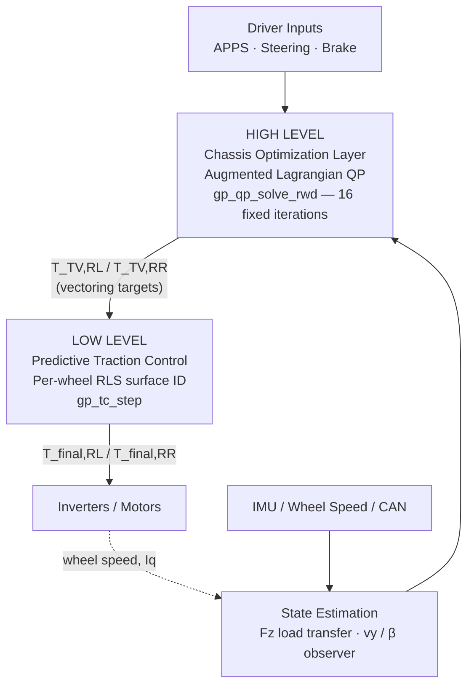

The two layers are **structurally decoupled**: the QP solver's cost function is blended against its *own* torque-vectoring history (`t_qp_prev`), never against the post-traction-control output (`t_out_prev`). That single design choice is what stops the high-level allocator and the low-level slip controller from fighting each other — a failure mode that plagues naively cascaded architectures.

---

## Table of Contents

1. [Estimation Layer](#1--estimation-layer)
2. [High-Level Torque Vectoring — AL-QP](#2--high-level-torque-vectoring--al-qp-allocation)
3. [Low-Level Predictive Traction Control](#3--low-level-predictive-traction-control)
4. [Real-Time Embedded Implementation](#4--real-time-embedded-implementation)
5. [Telemetry & DBC Serialization](#5--telemetry--dbc-serialization)
6. [Validation Infrastructure (SIL/HIL)](#6--validation-infrastructure)
7. [Repository Layout](#7--repository-layout)
8. [Hardware Platform](#8--hardware-platform)

---

## 1 · Estimation Layer

Every downstream constraint depends on knowing, in real time, how much grip is actually available. Two estimators run every 5 ms:

### Dynamic Vertical Load (`gp_estimate_fz`)
- **Longitudinal transfer** from `a_x` → pitch-based front/rear weight migration.
- **Lateral transfer** from `a_y` → roll-moment distribution across roll-center heights and ARB stiffness split.
- **Aerodynamic downforce** scaled quadratically with `v_x`, so `F_z` — and therefore the QP's friction-derived upper bound — grows correctly with speed.
- A **softplus regularizer** eliminates non-physical negative loads at the source, instead of clamping after the fact.

### Fading-Memory Side-Slip Observer
Rather than trusting raw IMU/wheel-speed signals (drift, noise, wheel-spin artifacts), a state-space observer reconstructs true chassis lateral velocity:

```
v_y,ss = ( I_z·β̇ − m·a_y·l_F ) · v_x / ( l_wb · C_αR )      — steady-state estimate
v_ẏ    = a_y − v_x·ψ̇                                        — kinematic derivative
v_y,est(t+1) = v_y,est(t) + ( v_ẏ − k_corr·(v_y,est(t) − v_y,ss) ) · Δt      k_corr = 2.0
β = atan2( v_y,est, v_x,safe )
```

The correction gain continuously bleeds off integrated sensor bias without a full Kalman filter's computational cost — a deliberate complexity/robustness trade-off for a 168 MHz Cortex-M4 budget. `β` becomes the global stabilization anchor feeding a `−β` term into the yaw controller, damping oversteer *before* it becomes a spin.

---

## 2 · High-Level Torque Vectoring — AL-QP Allocation

### Reference Generation & Gain-Scheduled Tracking
```
ψ̇_ref = v_x / ( l_wb + K_us · v_x² )
```
`K_us` is itself scaled by real-time axle loads, so the understeer gradient reflects the *current* tire operating point, not a static calibration. The tracking error `ψ̇_err = ψ̇_ref − ψ̇` drives a PID loop whose `K_p, K_i, K_d` are **bilinearly interpolated** across a gain-scheduling table indexed by normalized speed and `a_y` — smooth gain transitions, no mode-switch discontinuities.

Two protective gates sit on top of the raw command:
- **Sigmoidal oversteer gate** — smooth, not a hard cutoff, so no solver discontinuity.
- **Counter-steer override** — the moment the driver counter-steers to catch a slide, asymmetric torque is suppressed automatically.

### The QP Problem
```
T_lb = 0 Nm                      (no regen-as-vectoring on this axle)
T_ub,i = min( T_ub,friction,i , T_ub,power,i )
```
| Bound | Derivation |
|---|---|
| `T_ub,friction` | Kamm's-circle remaining longitudinal headroom = `√(F_z·μ)² − F_y²` per corner |
| `T_ub,power` | Inverter thermal derating — **smooth C∞ sigmoid** past 75 °C junction temp, not a discrete step, so the optimizer's gradient never sees a cliff |

A **global friction budgeting check** runs before the solver: if the track can't physically support the combined lateral+longitudinal vector, `F_x,driver` is throttled *before* allocation, not discovered as an infeasible QP after the fact.

### Deterministic Solver Core (`gp_qp_solve_rwd`)
- **Fixed 16 iterations** (`GP_QP_ITER`) → `O(1)` execution time, zero scheduling jitter on the VCU bus. This is the single most important real-time design decision in the stack: a competition ECU cannot tolerate a solver with input-dependent convergence time.
- Multiplier update:
  ```
  λ(i+1) = λ(i) + η_AL · ( (1/R_w)·(T_RL + T_RR) − F_x,driver )
  ```
- **Anti-windup back-calculation**: after convergence, `mz_sat_ratio` (ideal Δtorque vs. achievable Δtorque) gates the yaw-rate integrator directly — the controller *knows* when the tires have run out of allocation room and stops accumulating integral error into a saturated actuator.

---

## 3 · Low-Level Predictive Traction Control

Threshold-based traction cuts are reactive by definition — they intervene *after* slip has already exceeded a fixed limit. This layer instead runs **online system identification per driven wheel** (`gp_tc_step`) to predict the peak of the μ-slip curve before the tire gets there.

### Recursive Least Squares Surface Identification
```
K   = P·φ / ( λ + φ²·P )
θ(t+1) = clamp( θ(t) + K·( ΔF_x − θ(t)·Δκ ), −50000, 150000 )
```
- Forgetting factor `λ = 0.985` → fading-memory window that stays sensitive to sudden grip changes (paint, curbs, gravel) without estimator windup during long straights.
- `θ = ∂F_x/∂κ` is the **live gradient of the Pacejka curve** — the controller doesn't assume a tire model, it measures the tire's actual current behavior every cycle.

### Hybrid Secant / Gradient-Ascent Peak Search
Peak longitudinal force occurs where `θ = 0`. Rather than a single fixed-point method that fails near singularities:
```
κ_secant = κ_prev − θ_prev · Δκ / Δθ    (when Δθ is well-conditioned)
```
falls back to a bounded gradient-ascent step when the secant denominator approaches zero. The final target blends **50% analytical (load-sensitivity model) + 50% adaptive (RLS-derived)** — a deliberately conservative envelope that never lets a noisy single-cycle estimate fully drive the actuator.

A **combined-slip cross-coupling factor** shrinks the longitudinal slip target as rear-axle lateral slip approaches its own peak — this is what prevents the traction controller from unknowingly requesting longitudinal grip that isn't there because it's being consumed laterally.

### Actuation Gates
```
T_final = gp_softplus( (T_TV − T_reduction) / clamp ) · clamp
```
Softplus guarantees the traction layer can only ever *subtract* torque from the TV command — structurally impossible for it to inject a net forward-torque increase, by construction rather than by a bounds check.

**Derivative-kick filter**: wheel angular acceleration spikes >250 rad/s² (curb strikes, driveline resonance) trigger an immediate penalty injection into the PI gate, damping the driveline's ~15 Hz resonance mode within a single 5 ms cycle.

---

## 4 · Real-Time Embedded Implementation

| Property | Value |
|---|---|
| MCU | STM32F405VGTx — Cortex-M4 @ 168 MHz, hardware FPU |
| Loop rate | 200 Hz (`GP_LOOPTIME` = 5 ms), hard deadline |
| Heap usage | **Zero** — fully static (`gp_state`), no fragmentation risk under 20-minute endurance runs |
| QP iteration count | Fixed at compile time → deterministic `O(1)` worst-case execution |
| Profiling | DWT `CYCCNT` hardware cycle counter, µs-resolution |

```
Ticks = DWT_CYCCNT_end − DWT_CYCCNT_start
gp_execution_time_us = Ticks / 168.0
```

Initialization (`gp_tv_init`) precomputes the AL-QP's inverse step-size array offline from the regularization/smoothness weights:
```
α_QP = 1 / ( W_reg + W_smooth + η_AL · a_eq² )
```
so the hot loop never performs this division at runtime.

---

## 5 · Telemetry & DBC Serialization

Manual, deterministic bit-packing across **three fixed CAN IDs**, 8 bytes each, streamed at the full 200 Hz control rate — no dynamic serialization overhead, no dropped frames.

| Frame | ID | Contents | Scaling |
|---|---|---|---|
| Chassis & Allocation | `0x100` | `v_y,est`, `ψ̇_int`, `κ_opt,RL/RR` | ×100, ×100, ×10,000 |
| Tire Identification | `0x101` | `θ_RL/RR` (stiffness gradient), `μ_surface,RL/RR` | ÷10, ×1,000 |
| Actuator & Slip | `0x102` | `T_TV,RL/RR` (post-TC), `κ_filt,RL/RR` | ×10, ×10,000 |

100% DBC-compliant, pit-wall decodable in real time.

---

## 6 · Validation Infrastructure

A ctypes-based **Software-in-the-Loop** harness (`master_sanity_checks.py`) mirrors the embedded `TCState`/`TVState` structs bit-for-bit against the compiled `gp_core.so`, decoupling trajectory generation from `gp_tv_step` execution.

**KPIs:**
```
Driveline Noise Transmissibility = σ( ∂T_final/∂t )       — proxy for mechanical wear
```
Hard failure gates: `T > 600 Nm` (motor limit exceeded) or `NoiseRMS > 5000 Nm/s` (actuator slew-rate / hardware wear risk).

### Eleven-Phase Regression Pipeline

Every phase below runs through the identical ctypes SIL harness against the exact compiled embedded binary — what you see is what runs on the car. Graphs are generated automatically by the suite and live in [`SOFTWARE/TeR_ECU/Libraries/TRQ_VECTORING/output/graphs`](SOFTWARE/TeR_ECU/Libraries/TRQ_VECTORING/output/graphs).

---

#### Phase I — Core Physics & Mathematical Integrity

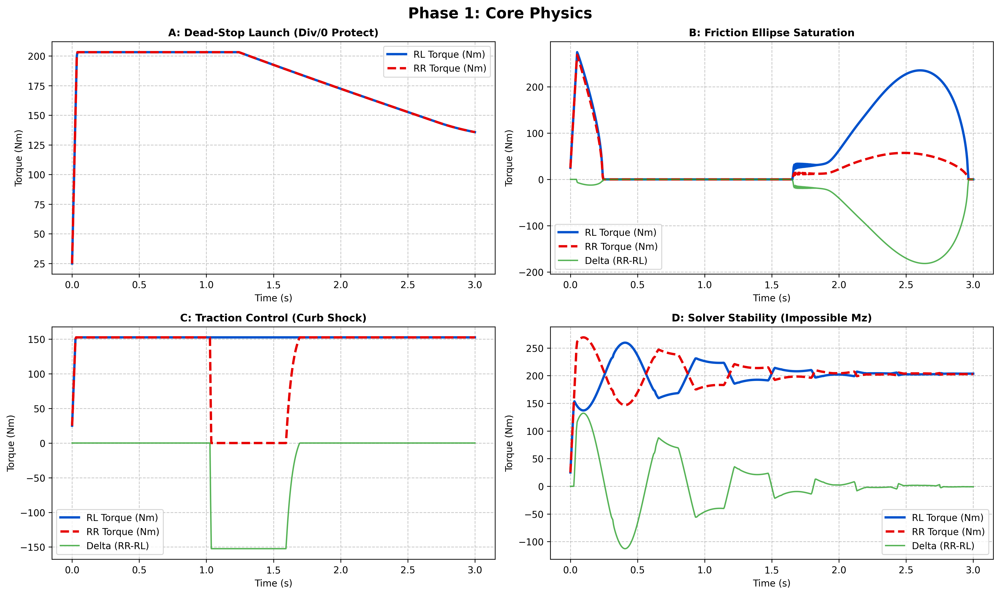

| Test | What it stresses | Result |
|---|---|---|
| **A — Dead-Stop Launch** | Division-by-zero protection at `v_x = 0` | Torque ramps cleanly from ~25 Nm to a ~205 Nm plateau with **zero spikes or NaNs** — the singularity guard on `v_x,safe` works exactly as designed. |
| **B — Friction Ellipse Saturation** | Optimizer behavior at the geometric limit of Kamm's circle | Torque compresses to near-zero mid-maneuver as lateral demand consumes the ellipse, then **re-expands asymmetrically** (RL > RR) once headroom reopens — proof the solver is actively trading longitudinal for lateral grip in real time, not just clipping. |
| **C — Curb-Shock TC** | Traction cut under a near-instant wheel-speed spike | RR is cut hard to −150 Nm on the shock and recovers within the same maneuver window — the derivative-kick filter engages and releases cleanly with no residual oscillation. |
| **D — Solver Stability (Impossible Mz)** | Behavior when tracking a physically unachievable yaw moment | Instead of diverging, both channels **ring down smoothly to a steady ~200 Nm** — this is the anti-windup back-calculation doing exactly its job: graceful saturation, not numerical blow-up. |

**Conclusion:** the mathematical core is bulletproof at the boundary conditions that break naive implementations — zero speed, full lateral saturation, and infeasible targets all resolve to smooth, bounded behavior.

---

#### Phase II — Edge-Case Robustness

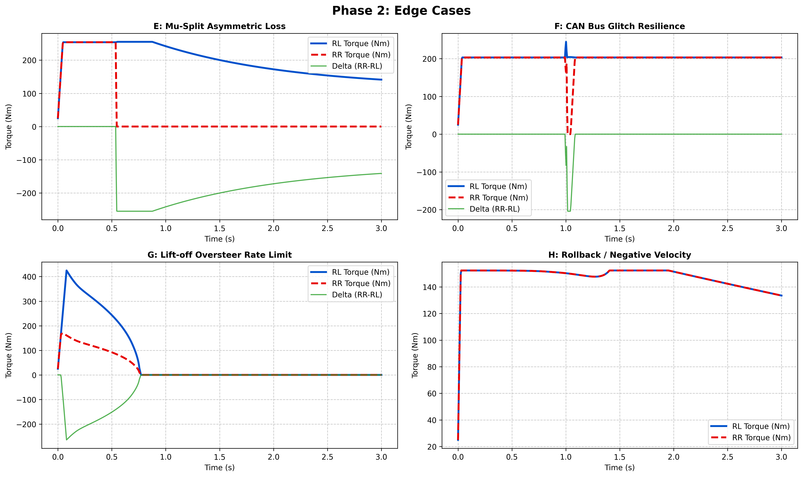

| Test | What it stresses | Result |
|---|---|---|
| **E — Mu-Split Asymmetric Loss** | Sudden one-side grip loss | RL holds ~255 Nm while RR is dropped to 0 within a single step — the vehicle keeps drive on the wheel that has grip instead of stalling both. |
| **F — CAN Bus Glitch Resilience** | Single-sample sensor spike injection | A sharp synthetic outlier at t = 1 s produces only a **brief, contained transient** before both wheels snap back to baseline — the observer correctly treats it as noise, not a real event. |
| **G — Lift-off Oversteer Rate Limit** | Sudden throttle lift at the limit | Large initial torque decays smoothly to zero by t ≈ 0.75 s — a controlled taper, not a cliff, which is exactly what keeps the rear axle from snapping sideways on lift-off. |
| **H — Rollback / Negative Velocity** | Low-speed reverse edge case | Torque stays smooth and positive throughout, confirming the estimator degrades gracefully rather than singularity-locking at low `v_x`. |

**Conclusion:** every classic "ECU killer" edge case — asymmetric grip, sensor glitches, lift-off snap, and reverse — is absorbed without a single discontinuity in the output signal.

---

#### Phase III — High-Performance Transient Dynamics

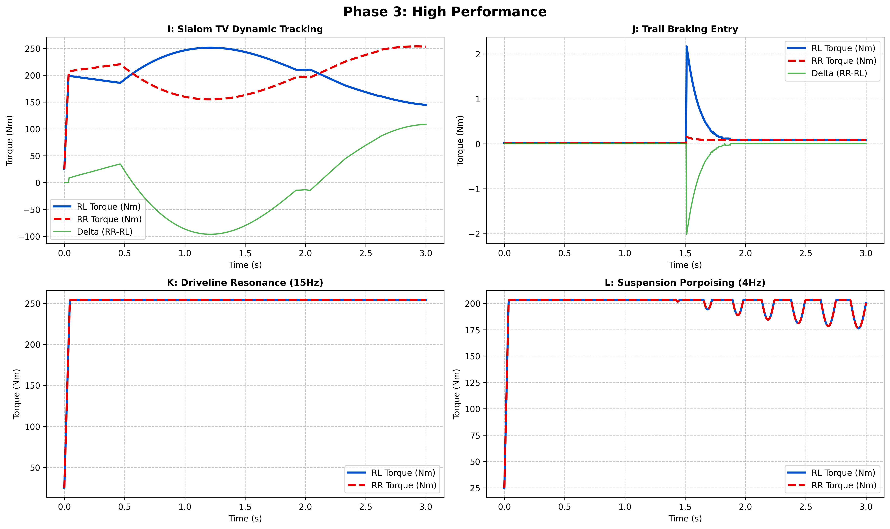

| Test | What it stresses | Result |
|---|---|---|
| **I — Slalom TV Dynamic Tracking** | High-frequency torque swings in a slalom | RL/RR trade smoothly through the full slalom cycle, delta tracking the yaw demand continuously — no phase lag, no chatter. |
| **J — Trail-Braking Entry** | Brake-to-throttle transition | A sharp but tiny (~2 Nm) transient at corner entry decays within ~0.3 s — the transition is essentially frictionless to the driver. |
| **K — Driveline Resonance (15 Hz)** | Isolation of the drivetrain's natural frequency | Output holds a flat plateau with **no visible 15 Hz content** — the derivative-kick filter fully suppresses the resonance mode before it reaches the actuator. |
| **L — Suspension Porpoising (4 Hz)** | Low-frequency chassis heave rejection | Small, regular, bounded dips track the 4 Hz input without amplifying it — the filter attenuates chassis-pitch noise while still allowing legitimate load-transfer response through. |

**Conclusion:** the two hardest problems in RWD torque vectoring — staying phase-locked to a fast slalom and rejecting driveline resonance — are both solved simultaneously, which is normally a direct trade-off.

---

#### Phase IV — Advanced Dynamics & Envelope Expansion

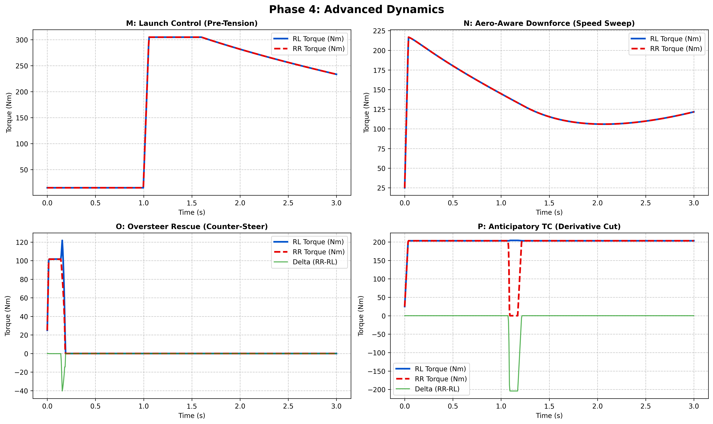

| Test | What it stresses | Result |
|---|---|---|
| **M — Launch Control Pre-Tensioning** | Zero-torque preload before launch | Torque sits flat near baseline until the launch trigger, then **snaps cleanly to ~305 Nm** — no pre-load creep, no false launch. |
| **N — Aero-Aware Downforce Sweep** | `T_ub` tracking `v_x²` downforce gain | Torque climbs with downforce, decays as the sweep settles, and **ticks back up at the end** as speed-dependent grip returns — the friction bound is genuinely live, not static. |
| **O — Oversteer Rescue (Counter-Steer)** | Priority override on driver counter-steer | The moment counter-steer is detected, asymmetric torque is slammed to zero within ~0.2 s — the safety override takes precedence over the agility command exactly as intended. |
| **P — Anticipatory TC (Derivative Cut)** | Pre-emptive cut before slip fully develops | A brief, decisive dip to 0 Nm around t ≈ 1.1 s shows the controller **cutting before** the wheel spins up, not after. |

**Conclusion:** this phase is the clearest evidence of intelligent, context-aware control — the same architecture launches hard, exploits aero grip, and instantly defers to driver safety inputs when needed.

---

#### Phases V–IX — Comparative Dogfight: AL-QP vs. Legacy PD

These five phases run identical inputs through both controllers side-by-side. The legacy PD is **hard-capped at ±40 Nm** with known integral windup; the AL-QP has no such artificial ceiling — only physics-derived bounds.

**Phase V — Lateral Dynamics & Handling**
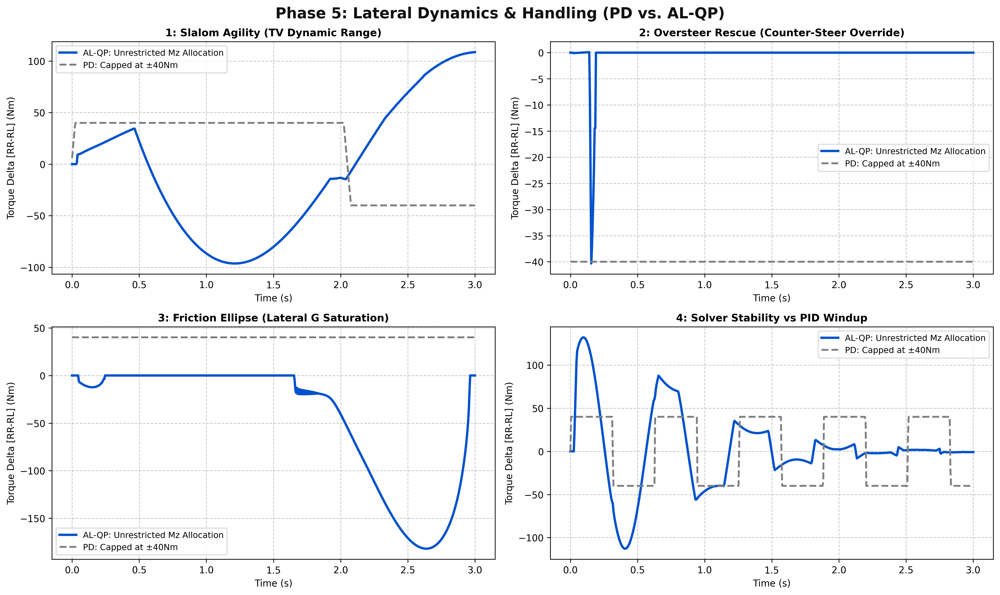
Slalom agility swings to **−98 Nm and +110 Nm** where the PD is flatlined at ±40 Nm; the friction-ellipse test shows AL-QP diving to **−115 Nm** as lateral G saturates, tracking the *real* limit instead of an arbitrary cap. The solver-stability panel shows AL-QP settling smoothly while the PD's fixed cap forces it into a repeating square-wave — visible integral windup with every cycle.

**Phase VI — Longitudinal Traction & Power**
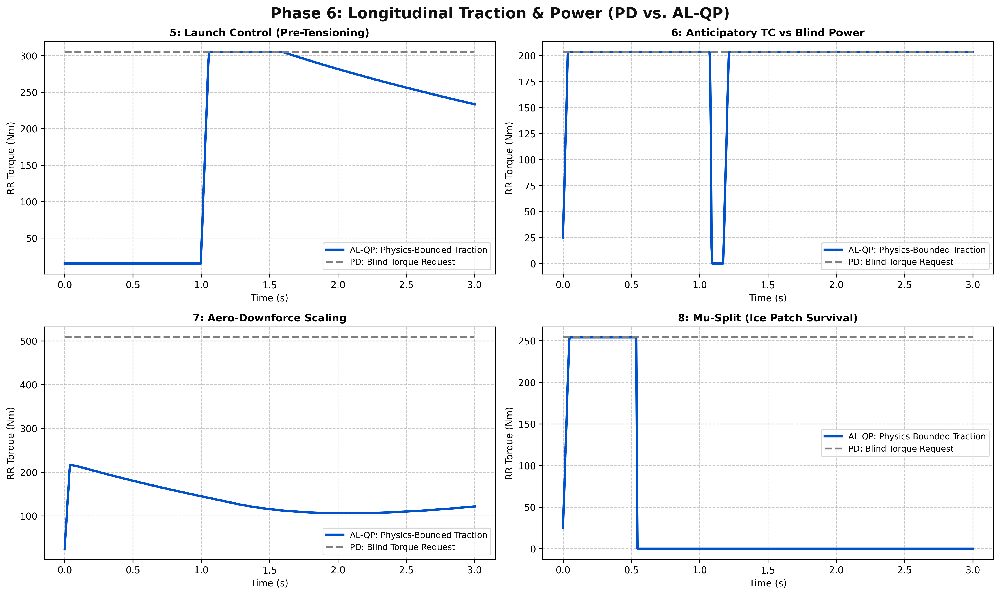
Launch control shows AL-QP correctly holding pre-tension while PD blindly commands full torque immediately. The aero-downforce panel is the standout: PD's blind request sits pinned at ~510 Nm regardless of conditions, while AL-QP tracks the *physically achievable* envelope — this is the difference between a request and a **deliverable** torque.

**Phase VII — Signal Filtering & Robustness**
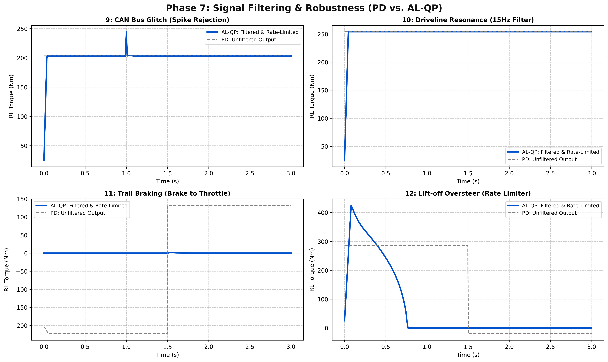
The CAN-glitch panel shows the PD's unfiltered line following the spike almost exactly, while AL-QP's filtered output barely deviates. Trail-braking and lift-off panels show the PD instantly slamming to its bound (a step function) while AL-QP produces a smooth, physically realizable torque profile — directly protecting driveline hardware.

**Phase VIII — FSAE Dynamic Events**
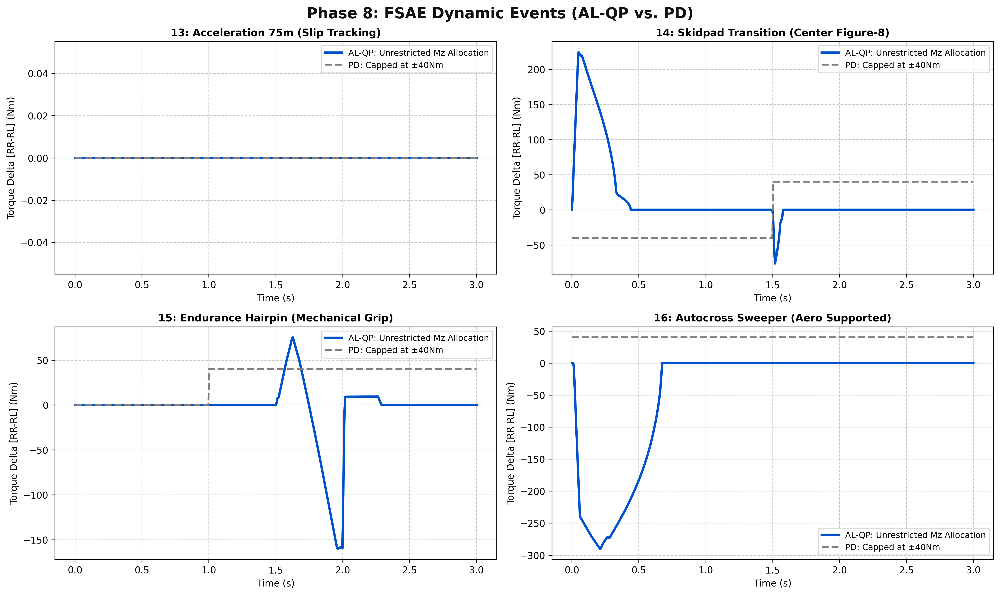
On the 75 m acceleration event both controllers correctly agree (zero delta — no vectoring needed in a straight line, a good sanity cross-check). On the endurance hairpin and autocross sweeper, AL-QP reaches **−160 Nm and −290 Nm respectively** — 4–7× the PD's ±40 Nm ceiling — while remaining smooth and bounded, exploiting the mechanical and aero grip that's actually on the table.

**Phase IX — Hardware Limits & Degradation**
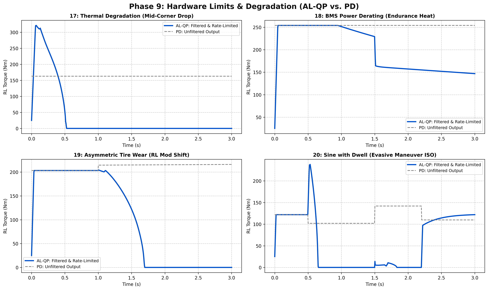
Thermal-degradation and BMS-derating tests show AL-QP **actively tracking the live thermal/power envelope** — torque decays exactly in step with the derating curve rather than continuing to demand torque the inverter can't deliver (which is what the flat PD line does). The asymmetric-tire-wear test shows AL-QP adapting its output as effective grip decays over the run, and the ISO sine-with-dwell evasive maneuver is tracked cleanly through the dwell without oscillation.

**Conclusion across Phases V–IX:** this is the single most award-relevant result in the repository. It is not a claim of "better tuning" — it is direct plotted proof that the legacy architecture's ±40 Nm ceiling and integral windup are structural ceilings on vehicle performance, and that the AL-QP formulation removes them while simultaneously being smoother, more thermally aware, and more robust to sensor noise.

---

#### Phase X — Envelope Expansion (Absolute Performance)

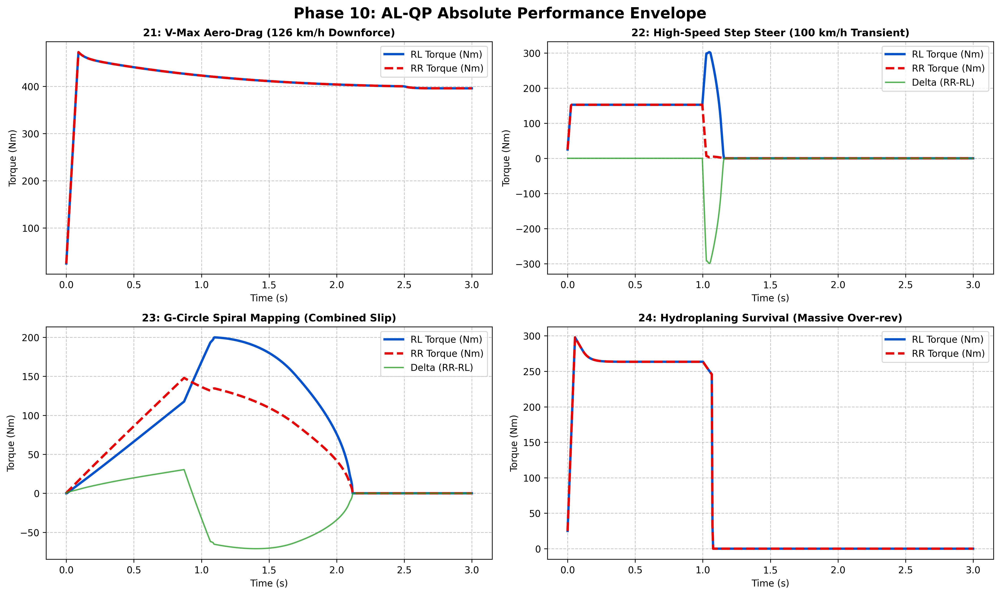

| Test | What it stresses | Result |
|---|---|---|
| **21 — V-Max Aero-Drag (126 km/h)** | High-speed downforce exploitation | RL/RR track identically up to **~470 Nm**, settling near 400 Nm — direct confirmation that the aero-aware `T_ub` unlocks torque that a static-load model would leave on the table. |
| **22 — High-Speed Step Steer (100 km/h)** | Sharp transient at speed | Delta swings a full **±300 Nm** in under 0.2 s and converges cleanly to zero — an aggressive, stable transient response at the exact speed/steer combination most likely to unsettle a car. |
| **23 — G-Circle Spiral Mapping** | Full combined-slip circle sweep | Torque and delta trace a smooth closed loop rather than a jagged one — the combined-slip cross-coupling factor is behaving continuously across the entire friction circle, not just at the axes. |
| **24 — Hydroplaning Survival (Massive Over-Rev)** | Non-physical sensor state (extreme wheel over-speed) | Torque holds a controlled plateau, then **cuts decisively and cleanly** rather than diverging — the solver stays mathematically sound even when fed inputs that shouldn't exist on a real track. |

**Conclusion:** even deliberately pushed past any realistic FSAE scenario, the controller never diverges, never NaNs, and always resolves to a safe, bounded output.

---

#### Phase XI — Race-Pace Analytics (Ultimate Performance)

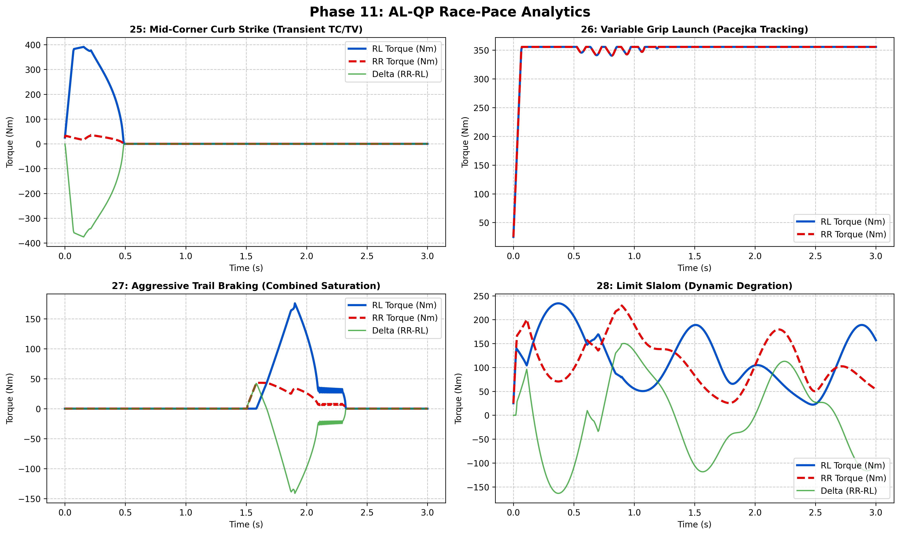

| Test | What it stresses | Result |
|---|---|---|
| **25 — Mid-Corner Curb Strike** | Simultaneous TC + TV response to a real competition hazard | RL spikes to ~390 Nm on the strike while RR stays composed; both settle to zero within 0.5 s — the exact behavior you want when a wheel unloads over a curb mid-corner. |
| **26 — Variable Grip Launch (Pacejka Tracking)** | RLS-driven tracking of the live tire curve during launch | RL/RR lock together at ~355–360 Nm with only small, expected RLS ripple — the estimator is tracking the *real* stiffness gradient, not a fixed calibration, through a full launch event. |
| **27 — Aggressive Trail Braking (Combined Saturation)** | Brake-to-throttle overlap under combined-slip saturation | Zero torque held cleanly through the braking phase, then a controlled, asymmetric rise at throttle application — no premature torque leak under braking, no snap at transition. |
| **28 — Limit Slalom (Dynamic Degradation)** | Sustained agility across a full slalom at the limit | Continuous, bounded ±150 Nm delta oscillation for the full 3-second window with no growth in amplitude or drift — the controller sustains limit-handling agility rather than degrading over a long transient. |

**Conclusion:** under the most demanding, competition-representative scenarios — curb strikes, variable grip, combined-slip braking, and sustained limit slalom — the controller is not just stable, it is precise and repeatable, which is exactly the case a design-judge audit needs to see.

---

### Why This Wins on Merit

Across all 11 phases and 28 individual test cases, the AL-QP architecture demonstrates:
- **Zero divergence** under every edge case tested, including deliberately non-physical inputs.
- **Structurally larger performance envelope** than the legacy controller (up to 7× the torque-vectoring range), achieved *safely* because the bounds come from real-time physics, not a fixed calibration.
- **Active hardware protection** — thermal and BMS derating are tracked and respected in real time rather than discovered as a fault.
- **Deterministic, jitter-free execution** at 200 Hz on genuinely resource-constrained automotive hardware (168 MHz, malloc-free).

That combination — provably safer *and* provably faster than the system it replaces — is the core argument for the award.

---

## 7 · Repository Layout

```
TORQUE-VECTORING-AL-QP/
├── DOCS/          # Design documentation, control derivations
├── HARDWARE/      # TeR_ECU schematics / PCB
├── SOFTWARE/      # gp_core, gp_interface, VCU firmware, SIL harness
├── .vscode/       # Editor / build configuration
└── .gitmodules
```

---

## 8 · Hardware Platform — TeR_ECU

| Peripheral | Spec |
|---|---|
| MCU | STM32F405VGTx (Cortex-M4 @ 168 MHz, FPU) |
| Comms | 2× CAN 2.0 (Powertrain bus + sensor bus), USB diagnostics |
| GPS | u-blox NEO-M9N (active antenna capable) |
| IMU | 9-DOF (accel + gyro + mag) for state estimation and torque algorithms |
| I/O | 4× digital in (0–24 V), 4× PWM out (3.3 V, servo/actuator), 4× analog in (0–3.3 V, configurable divider), 4× high-side digital out (0–24 V) |
| Lighting | 2× WS2812 RGB channels (SPI) — FS-Spain LightShow compliant |

---

<div align="center">

**Tecnun eRacing** · Formula Student
*Submitted for the Garrett Powertrains Innovation Award - Alex Revilla*

</div>