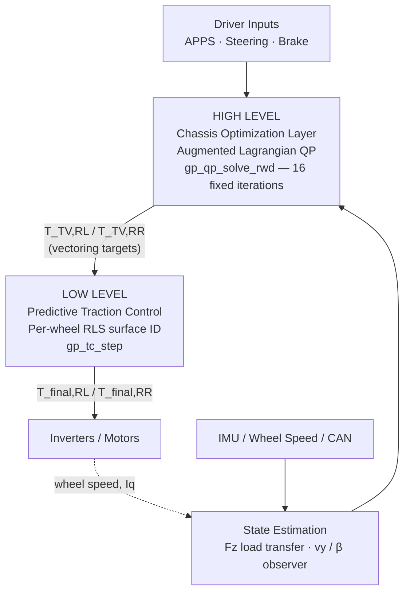

<div align="center">

# TORQUE-VECTORING-AL-QP
### Predictive Torque Vectoring & Traction Control for a RWD Formula Student EV

**Team Ter26 · TeR_ECU Vehicle Control Unit**


-orange?style=flat-square)


*A deterministic, malloc-free, cascaded chassis controller that replaces open-loop kinematic torque maps with a real-time optimal allocation core and an adaptive, RLS-driven traction control layer.*

</div>

---

## Why This Exists

Legacy RWD torque-vectoring on FS cars is almost universally a **kinematic feedforward map**: differential torque as a static function of steering angle and speed. It has no state feedback on load transfer, lateral force saturation, or combined-slip. Near the limit — right where lap time is won — an open-loop yaw moment command stacks longitudinal demand on a tire that's already saturated laterally. Result: driveline chatter, uncontrolled side-slip growth, spins.

This project replaces that map with a **hierarchical cascaded controller** running at a hard **200 Hz / 5 ms** on the VCU:



The two layers are **structurally decoupled**: the QP solver's cost function is blended against its *own* torque-vectoring history (`t_qp_prev`), never against the post-traction-control output (`t_out_prev`). That single design choice is what stops the high-level allocator and the low-level slip controller from fighting each other — a failure mode that plagues naively cascaded architectures.

---

## Table of Contents

1. [Estimation Layer](#1--estimation-layer)
2. [High-Level Torque Vectoring — AL-QP](#2--high-level-torque-vectoring--al-qp-allocation)
3. [Low-Level Predictive Traction Control](#3--low-level-predictive-traction-control)
4. [Real-Time Embedded Implementation](#4--real-time-embedded-implementation)
5. [Telemetry & DBC Serialization](#5--telemetry--dbc-serialization)
6. [Validation Infrastructure (SIL/HIL)](#6--validation-infrastructure)
7. [Repository Layout](#7--repository-layout)
8. [Hardware Platform](#8--hardware-platform)

---

## 1 · Estimation Layer

Every downstream constraint depends on knowing, in real time, how much grip is actually available. Two estimators run every 5 ms:

### Dynamic Vertical Load (`gp_estimate_fz`)
- **Longitudinal transfer** from `a_x` → pitch-based front/rear weight migration.
- **Lateral transfer** from `a_y` → roll-moment distribution across roll-center heights and ARB stiffness split.
- **Aerodynamic downforce** scaled quadratically with `v_x`, so `F_z` — and therefore the QP's friction-derived upper bound — grows correctly with speed.
- A **softplus regularizer** eliminates non-physical negative loads at the source, instead of clamping after the fact.

### Fading-Memory Side-Slip Observer
Rather than trusting raw IMU/wheel-speed signals (drift, noise, wheel-spin artifacts), a state-space observer reconstructs true chassis lateral velocity:

```
v_y,ss = ( I_z·β̇ − m·a_y·l_F ) · v_x / ( l_wb · C_αR )      — steady-state estimate
v_ẏ    = a_y − v_x·ψ̇                                        — kinematic derivative
v_y,est(t+1) = v_y,est(t) + ( v_ẏ − k_corr·(v_y,est(t) − v_y,ss) ) · Δt      k_corr = 2.0
β = atan2( v_y,est, v_x,safe )
```

The correction gain continuously bleeds off integrated sensor bias without a full Kalman filter's computational cost — a deliberate complexity/robustness trade-off for a 168 MHz Cortex-M4 budget. `β` becomes the global stabilization anchor feeding a `−β` term into the yaw controller, damping oversteer *before* it becomes a spin.

---

## 2 · High-Level Torque Vectoring — AL-QP Allocation

### Reference Generation & Gain-Scheduled Tracking
```
ψ̇_ref = v_x / ( l_wb + K_us · v_x² )
```
`K_us` is itself scaled by real-time axle loads, so the understeer gradient reflects the *current* tire operating point, not a static calibration. The tracking error `ψ̇_err = ψ̇_ref − ψ̇` drives a PID loop whose `K_p, K_i, K_d` are **bilinearly interpolated** across a gain-scheduling table indexed by normalized speed and `a_y` — smooth gain transitions, no mode-switch discontinuities.

Two protective gates sit on top of the raw command:
- **Sigmoidal oversteer gate** — smooth, not a hard cutoff, so no solver discontinuity.
- **Counter-steer override** — the moment the driver counter-steers to catch a slide, asymmetric torque is suppressed automatically.

### The QP Problem
```
T_lb = 0 Nm                      (no regen-as-vectoring on this axle)
T_ub,i = min( T_ub,friction,i , T_ub,power,i )
```
| Bound | Derivation |
|---|---|
| `T_ub,friction` | Kamm's-circle remaining longitudinal headroom = `√(F_z·μ)² − F_y²` per corner |
| `T_ub,power` | Inverter thermal derating — **smooth C∞ sigmoid** past 75 °C junction temp, not a discrete step, so the optimizer's gradient never sees a cliff |

A **global friction budgeting check** runs before the solver: if the track can't physically support the combined lateral+longitudinal vector, `F_x,driver` is throttled *before* allocation, not discovered as an infeasible QP after the fact.

### Deterministic Solver Core (`gp_qp_solve_rwd`)
- **Fixed 16 iterations** (`GP_QP_ITER`) → `O(1)` execution time, zero scheduling jitter on the VCU bus. This is the single most important real-time design decision in the stack: a competition ECU cannot tolerate a solver with input-dependent convergence time.
- Multiplier update:
  ```
  λ(i+1) = λ(i) + η_AL · ( (1/R_w)·(T_RL + T_RR) − F_x,driver )
  ```
- **Anti-windup back-calculation**: after convergence, `mz_sat_ratio` (ideal Δtorque vs. achievable Δtorque) gates the yaw-rate integrator directly — the controller *knows* when the tires have run out of allocation room and stops accumulating integral error into a saturated actuator.

---

## 3 · Low-Level Predictive Traction Control

Threshold-based traction cuts are reactive by definition — they intervene *after* slip has already exceeded a fixed limit. This layer instead runs **online system identification per driven wheel** (`gp_tc_step`) to predict the peak of the μ-slip curve before the tire gets there.

### Recursive Least Squares Surface Identification
```
K   = P·φ / ( λ + φ²·P )
θ(t+1) = clamp( θ(t) + K·( ΔF_x − θ(t)·Δκ ), −50000, 150000 )
```
- Forgetting factor `λ = 0.985` → fading-memory window that stays sensitive to sudden grip changes (paint, curbs, gravel) without estimator windup during long straights.
- `θ = ∂F_x/∂κ` is the **live gradient of the Pacejka curve** — the controller doesn't assume a tire model, it measures the tire's actual current behavior every cycle.

### Hybrid Secant / Gradient-Ascent Peak Search
Peak longitudinal force occurs where `θ = 0`. Rather than a single fixed-point method that fails near singularities:
```
κ_secant = κ_prev − θ_prev · Δκ / Δθ    (when Δθ is well-conditioned)
```
falls back to a bounded gradient-ascent step when the secant denominator approaches zero. The final target blends **50% analytical (load-sensitivity model) + 50% adaptive (RLS-derived)** — a deliberately conservative envelope that never lets a noisy single-cycle estimate fully drive the actuator.

A **combined-slip cross-coupling factor** shrinks the longitudinal slip target as rear-axle lateral slip approaches its own peak — this is what prevents the traction controller from unknowingly requesting longitudinal grip that isn't there because it's being consumed laterally.

### Actuation Gates
```
T_final = gp_softplus( (T_TV − T_reduction) / clamp ) · clamp
```
Softplus guarantees the traction layer can only ever *subtract* torque from the TV command — structurally impossible for it to inject a net forward-torque increase, by construction rather than by a bounds check.

**Derivative-kick filter**: wheel angular acceleration spikes >250 rad/s² (curb strikes, driveline resonance) trigger an immediate penalty injection into the PI gate, damping the driveline's ~15 Hz resonance mode within a single 5 ms cycle.

---

## 4 · Real-Time Embedded Implementation

| Property | Value |
|---|---|
| MCU | STM32F405VGTx — Cortex-M4 @ 168 MHz, hardware FPU |
| Loop rate | 200 Hz (`GP_LOOPTIME` = 5 ms), hard deadline |
| Heap usage | **Zero** — fully static (`gp_state`), no fragmentation risk under 20-minute endurance runs |
| QP iteration count | Fixed at compile time → deterministic `O(1)` worst-case execution |
| Profiling | DWT `CYCCNT` hardware cycle counter, µs-resolution |

```
Ticks = DWT_CYCCNT_end − DWT_CYCCNT_start
gp_execution_time_us = Ticks / 168.0
```

Initialization (`gp_tv_init`) precomputes the AL-QP's inverse step-size array offline from the regularization/smoothness weights:
```
α_QP = 1 / ( W_reg + W_smooth + η_AL · a_eq² )
```
so the hot loop never performs this division at runtime.

---

## 5 · Telemetry & DBC Serialization

Manual, deterministic bit-packing across **three fixed CAN IDs**, 8 bytes each, streamed at the full 200 Hz control rate — no dynamic serialization overhead, no dropped frames.

| Frame | ID | Contents | Scaling |
|---|---|---|---|
| Chassis & Allocation | `0x100` | `v_y,est`, `ψ̇_int`, `κ_opt,RL/RR` | ×100, ×100, ×10,000 |
| Tire Identification | `0x101` | `θ_RL/RR` (stiffness gradient), `μ_surface,RL/RR` | ÷10, ×1,000 |
| Actuator & Slip | `0x102` | `T_TV,RL/RR` (post-TC), `κ_filt,RL/RR` | ×10, ×10,000 |

100% DBC-compliant, pit-wall decodable in real time.

---

## 6 · Validation Infrastructure

A ctypes-based **Software-in-the-Loop** harness (`master_sanity_checks.py`) mirrors the embedded `TCState`/`TVState` structs bit-for-bit against the compiled `gp_core.so`, decoupling trajectory generation from `gp_tv_step` execution.

**KPIs:**
```
Driveline Noise Transmissibility = σ( ∂T_final/∂t )       — proxy for mechanical wear
```
Hard failure gates: `T > 600 Nm` (motor limit exceeded) or `NoiseRMS > 5000 Nm/s` (actuator slew-rate / hardware wear risk).

### Five-Stage Regression Pipeline

| Phase | Focus | Representative Tests |
|---|---|---|
| **I — Core Integrity** | Mathematical stability | Dead-stop launch (`v_x=0` singularity), friction-ellipse saturation, curb-shock TC, forced-infeasible solver stability |
| **II — Edge-Case Robustness** | Sensor/signal faults | μ-split asymmetric loss, CAN glitch resilience, lift-off oversteer rate limit, low-speed rollback |
| **III — Transient Dynamics** | Agility under load | Slalom TV tracking, trail-braking entry, 15 Hz driveline resonance, 4 Hz suspension porpoising |
| **IV — Envelope Expansion** | Non-linear regimes | Launch pre-tensioning, aero-aware downforce sweep (`v_x²` scaling), oversteer rescue, anticipatory TC |
| **V–IX — Dogfight & Competition** | AL-QP vs. legacy PD | Skidpad, hairpins, BMS derating, asymmetric tire wear — demonstrates *unrestricted* Mz allocation vs. legacy's hard 40 Nm saturation ceiling and integral windup |
| **X–XI — Absolute Performance** | Bulletproofing & race pace | Hydroplaning over-rev edge cases, mid-corner curb strikes, aggressive trail braking under realistic entropy |

The Phase V–IX comparative plots are the direct evidence that this architecture is **not incrementally better but categorically different** from the legacy controller: the legacy system's hard-coded 40 Nm saturation and integral windup are structural limitations that the AL-QP formulation removes entirely, rather than mitigates.

---

## 7 · Repository Layout

```
TORQUE-VECTORING-AL-QP/
├── DOCS/          # Design documentation, control derivations
├── HARDWARE/      # TeR_ECU schematics / PCB
├── SOFTWARE/      # gp_core, gp_interface, VCU firmware, SIL harness
├── .vscode/       # Editor / build configuration
└── .gitmodules
```

---

## 8 · Hardware Platform — TeR_ECU

| Peripheral | Spec |
|---|---|
| MCU | STM32F405VGTx (Cortex-M4 @ 168 MHz, FPU) |
| Comms | 2× CAN 2.0 (Powertrain bus + sensor bus), USB diagnostics |
| GPS | u-blox NEO-M9N (active antenna capable) |
| IMU | 9-DOF (accel + gyro + mag) for state estimation and torque algorithms |
| I/O | 4× digital in (0–24 V), 4× PWM out (3.3 V, servo/actuator), 4× analog in (0–3.3 V, configurable divider), 4× high-side digital out (0–24 V) |
| Lighting | 2× WS2812 RGB channels (SPI) — FS-Spain LightShow compliant |

---

<div align="center">

**Team Ter26** · Formula Student
*Submitted for the Garrett Powertrains Innovation Award*

</div>